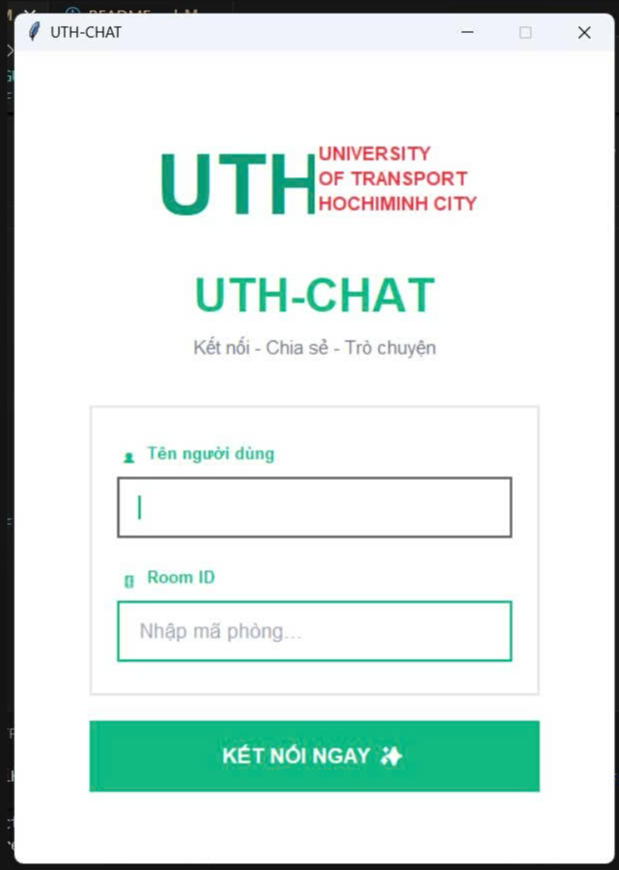
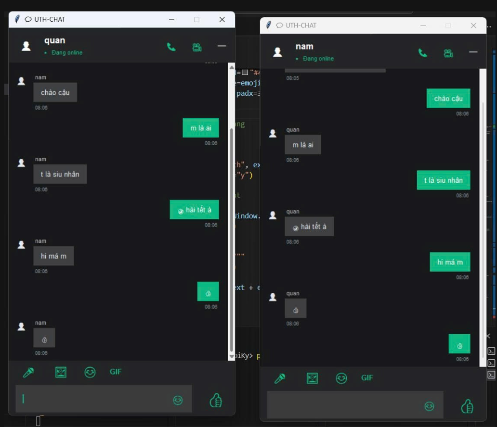

# LTM_CuoiKy — Chat Room

Ứng dụng chat đơn giản (giao diện Tkinter) dùng TCP socket để kết nối tới server.

Tài liệu này liệt kê các chức năng chính của project và cách chạy nhanh.

## Các chức năng chính

- Kết nối TCP tới server (mặc định: 127.0.0.1:12345). Khi join client gửi tên và room để handshake.
- Form đăng nhập: nhập Tên người dùng và Room ID.
- Tham gia hoặc tạo phòng bằng Room ID.
- Gửi/nhận tin nhắn text:
- Hỗ trợ file
- Emoji & reactions (ở một phiên bản):
  - Có emoji picker, có nút gửi Like (👍).
- Tự động cuộn xuống cuối khi có tin nhắn mới, xử lý lỗi kết nối, và hiển thị thông báo lỗi khi mất kết nối.

## Yêu cầu & cách chạy nhanh

- Yêu cầu: Python 3.8+, gói Pillow nếu muốn hỗ trợ hiển thị ảnh (pip install pillow).
- Chạy server (nếu bạn có file `server.py` trong repo):

```powershell
python server.py
```

- Chạy client (giao diện chính hiện tại):

```powershell
python client_GUI.py
```

## Giao diện




